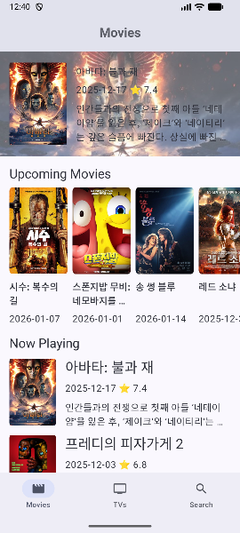
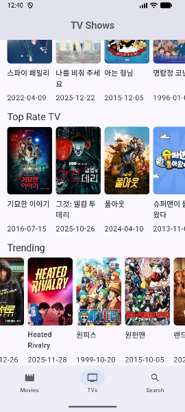
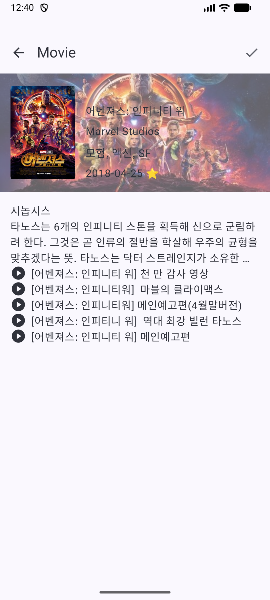

# 🎬 MovieTMDB (Jetpack Compose Movie App)

**MovieTMDB**는 TMDB API를 활용하여 최신 영화 및 TV 프로그램 정보를 제공하는 안드로이드 애플리케이션입니다.
이 프로젝트는 **Modern Android Architecture**를 준수하며, **Jetpack Compose**를 활용한 선언형 UI, **Clean Architecture
** 기반의 모듈화, 그리고 **퍼포먼스 최적화**에 중점을 둔 포트폴리오용 프로젝트입니다.

---

## 🛠 Tech Stack

| Category          | Technology                               |
|-------------------|------------------------------------------|
| **Language**      | Kotlin                                   |
| **UI Framework**  | Jetpack Compose (Material3)              |
| **Architecture**  | Clean Architecture (Multi-module), MVVM  |
| **DI**            | Hilt                                     |
| **Async**         | Coroutines, Flow                         |
| **Network**       | Retrofit2, OkHttp3, Kotlin Serialization |
| **Image Loading** | Coil3                                    |
| **Navigation**    | Androidx Navigation3 (Compose)           |

---

## 🏗 Project Structure & Architecture

이 프로젝트는 **Clean Architecture** 원칙에 따라 관심사를 분리하고 유지보수성을 높이기 위해 멀티 모듈 구조로 설계되었습니다.

```text
📂 movietmdb
├── 📂 app            # [Presentation Layer] UI 및 ViewModel, DI 설정
│   ├── 📂 ui         # Screen, Component, Theme
│   ├── 📂 navi       # Navigation Route 정의
├── 📂 domain         # [Domain Layer] 비즈니스 로직 (순수 Kotlin)
│   ├── 📂 model      # 데이터 모델 (Interface, Data class)
│   ├── 📂 repository # Repository Interface
│   └── 📂 usecase    # 비즈니스 로직 단위 (UseCase)
├── 📂 data           # [Data Layer] 데이터 소스 및 구현체
│   ├── 📂 module     # Hilt Dependency Injection 모듈
│   ├── 📂 service    # Retrofit Service
│   ├── 📂 repository # Repository Implementation
│   └── 📂 model      # API Response DTO
└── 📂 NetworkFetcher # [Core/Utility] 네트워크 상태 관리 및 공통 유틸리티
```

---

## ✨ Key Features (주요 기능)

### 1. 홈 화면 (Home Screen)

- **탭 기반 탐색:** `Movies`, `TV Shows`, `Search` 3개의 메인 탭을 제공합니다.
- **섹션별 데이터:**
    - **Now Playing / Airing Today:** 현재 상영/방영 중인 컨텐츠 리스트
    - **Trending:** 가로 스크롤 가능한 트렌딩 배너 (`HorizontalPager`)
    - **Upcoming / Top Rated:** 가로 스크롤 리스트 (`LazyRow`)

| Movie                                    | TV                                 | Search                                     |
|:-----------------------------------------|:-----------------------------------|:-------------------------------------------|
|  |  |  |

### 2. 상세 화면 (Detail Screen)

- **몰입형 UI:** 배경에 백드롭 이미지를 적용하여 시각적 완성도를 높였습니다. (성능을 위해 실시간 Blur 대신 투명도 최적화 적용)
- **정보 제공:** 포스터, 제목, 평점, 장르, 제작사, 시놉시스 등 상세 정보를 표시합니다.
- **관련 영상:** 예고편 등의 관련 비디오 리스트를 제공합니다.


### 3. 검색 (Search)

- 키워드를 통해 영화 및 TV 프로그램을 검색할 수 있는 기능을 제공합니다.

https://github.com/user-attachments/assets/f1e1467e-fe13-4a74-ab65-6f0517bc2977

---

## 🚀 Technical Highlights (기술적 특징 및 최적화)

이 프로젝트는 단순한 기능 구현을 넘어, 실제 앱에서 발생할 수 있는 **성능 문제 해결**과 **사용자 경험(UX) 개선**에 집중했습니다.

1. **Navigation 3 사용 (뒤로 가기 예측 가능)**
    - `androidx.navigation3`를 도입하여 **상태 기반 내비게이션**을 구현했습니다. `rememberNavBackStack`과 `NavDisplay`를 통해
      현재 경로(Route)를 리스트 형태로 관리하며, 이는 안드로이드의 예측 가능한 뒤로 가기(Predictive Back) 동작과 완벽하게 호환됩니다.

2. **CompositionLocal을 사용한 Dialog 관리**
    - `MovieDialog.kt`에서 `LocalMovieDialogStatus`라는 `CompositionLocal`을 정의하여 다이얼로그의 상태를 전역적으로 관리합니다.
      이를 통해 UI 트리 깊숙한 곳이나 ViewModel의 에러 콜백 등 Composable 함수가 아닌 곳에서도 다이얼로그를 즉시 띄울 수 있도록 설계되었습니다.

3. **NetworkFetcher를 통한 선언적 네트워크 요청**
    - 네트워크 요청의 생명주기를 관리하는 커스텀 `NetworkFetcher`를 구현했습니다.
        - **간편한 refresh:** `NetworkResult` 객체의 `refresh()` 함수를 호출하여 데이터 갱신을 트리거합니다.
        - **데이터 유실 방지:** 로딩 중에도 `cachedData`를 유지하여 끊김 없는 UX를 제공합니다.
        - **상세 화면 최적화:** 이전 화면에서 받아온 데이터를 즉시 전달받아 로딩 지연 없이 상세 정보를 표시합니다.

4. **MutateFetcher를 사용한 인터랙션 처리**
    - 검색이나 데이터 수정과 같은 파라미터 동반 동작을 위해 `MutateFetcher`를 설계했습니다.
        - **외부 요청 대응:** `Composable` 밖(버튼 클릭 리스너 등)에서 `fetch(params)` 형태로 간단편하게 데이터 요청을 보낼 수 있습니다.
        - **상태 추적:** `Idle`, `Loading`, `Success`, `Error` 상태를 추적하여 UI에 반영할 수 있습니다.
        - **사이드 이펙트 연결:** 요청 결과에 따라 `onSuccess`, `onError` 콜백을 지원하여 스낵바 출력이나 다이얼로그 표시 등을 간편하게 처리합니다.
        - **유지보수 간편성:** 이 모든 기능을 하나의 `MutateResult`로 처리 하기 때문에 `ViewModel`이 간단해 지고 유지 보수가
          쉽습니다. *
          *([SearchViewModel](app/src/main/java/com/gondev/movie/ui/screen/home/tabs/SearchViewModel.kt)
          참고)**

5. **Navigation 3과 통합된 Hilt DI**
    - `rememberViewModelStoreNavEntryDecorator`를 사용하여 내비게이션 각 경로마다 독립적인 `ViewModelStore`를 할당합니다.
      `hiltViewModel()`이 화면의 생명주기와 동기화되어 효율적인 메모리 관리와 의존성 주입이 가능합니다.

6. **Clean Architecture (Multi-module) 적용**
    - `app`, `domain`, `data` 모듈로 분리하여 관심사를 분리했습니다. `domain` 모듈은 순수 Kotlin으로 구성되어 테스트 용이성을 확보하고, 계층
      간 의존성을 단방향으로 강제하여 유지보수성을 높였습니다.

7. **UseCase를 통한 비즈니스 로직 캡슐화**
    - `domain` 계층에 단일 책임 원칙을 준수하는 `UseCase`를 배치했습니다. ViewModel은 `UseCase`를 통해 필요한 로직을 수행하며, 이는 로직의
      재사용성을 높이고 복잡한 비즈니스 규칙을 명확하게 분리합니다.
